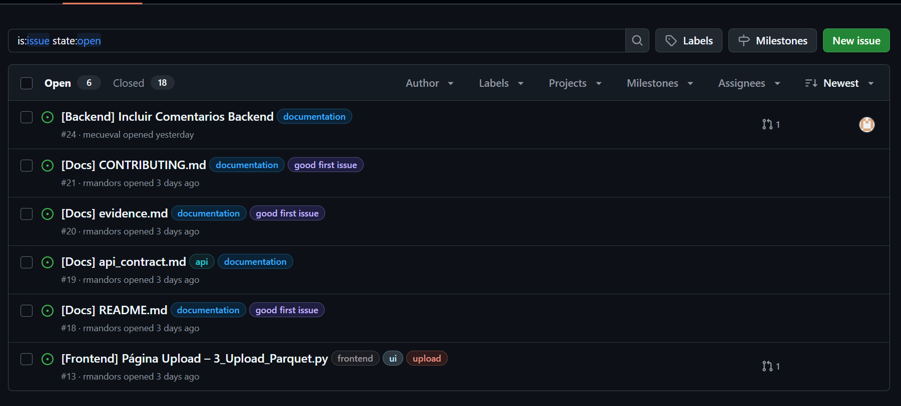
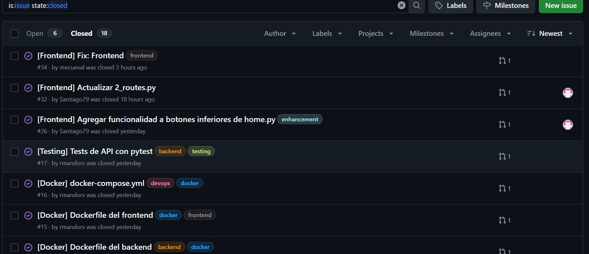
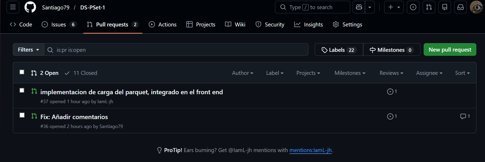
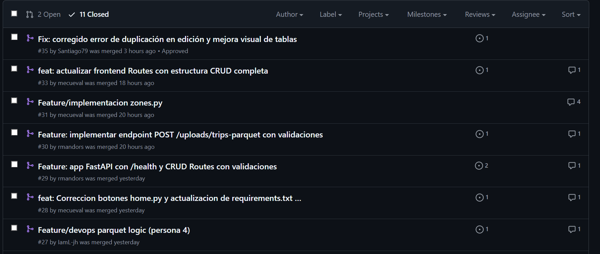
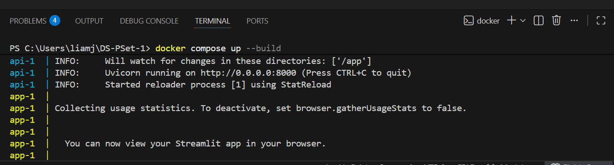
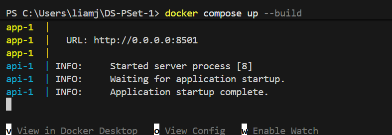
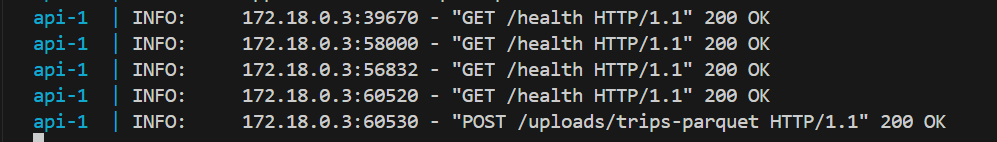
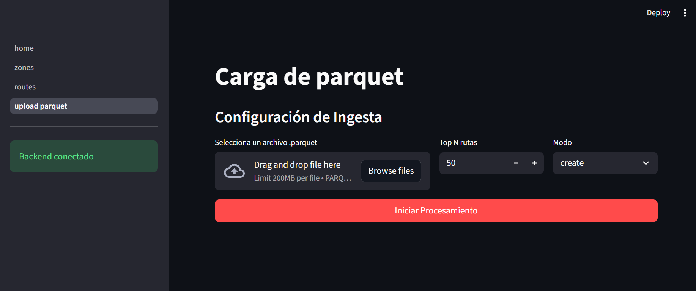
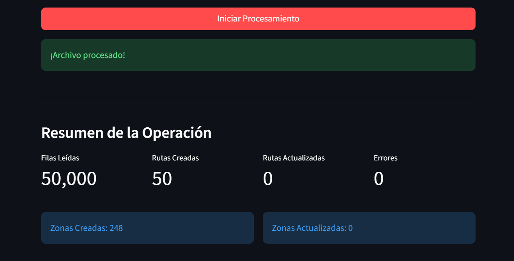

# Evidencias de Implementación - Proyecto DS-PSet-1

Este documento centraliza las pruebas de funcionamiento de los módulos desarrollados por el equipo, así como la gestión del flujo de trabajo en GitHub.

---

## Gestión del Proyecto (GitHub)

En esta sección se documenta el uso de herramientas de colaboración para el desarrollo del proyecto.

* **Issues:** Evidencia del uso de tickets para el seguimiento de tareas pendientes y objetivos.

* **Pull Requests:** Evidencia de la integración de ramas y revisión de código por parte del equipo.

---

## Evidencias por Integrante

Cada miembro del equipo es responsable de elegir y subir las capturas o logs que mejor representen el cumplimiento de sus objetivos técnicos.

### Persona 1: Backend de Zonas
*Espacio reservado para evidencias de: CRUD de zonas, Schemas de validación y resultados de tests unitarios.*

---

### Persona 2: Backend de Rutas
*Espacio reservado para evidencias de: Validación de integridad de rutas (pickup/dropoff), filtros de búsqueda y lógica de negocio.*

---

### Persona 3: Frontend de Zonas
*Espacio reservado para evidencias de: Interfaz de usuario en Streamlit, navegación de la app, formularios de gestión de zonas y manejo de alertas/errores.*

---

### Persona 4: DevOps y Carga Masiva (Parquet)
*Espacio reservado para evidencias de: Infraestructura Docker (contenedores activos), proceso de ingesta de archivos Parquet con resumen de métricas y visualización de la página de Rutas.*

**Infraestructura Docker:**

**Ingesta de Datos Parquet:**

---
